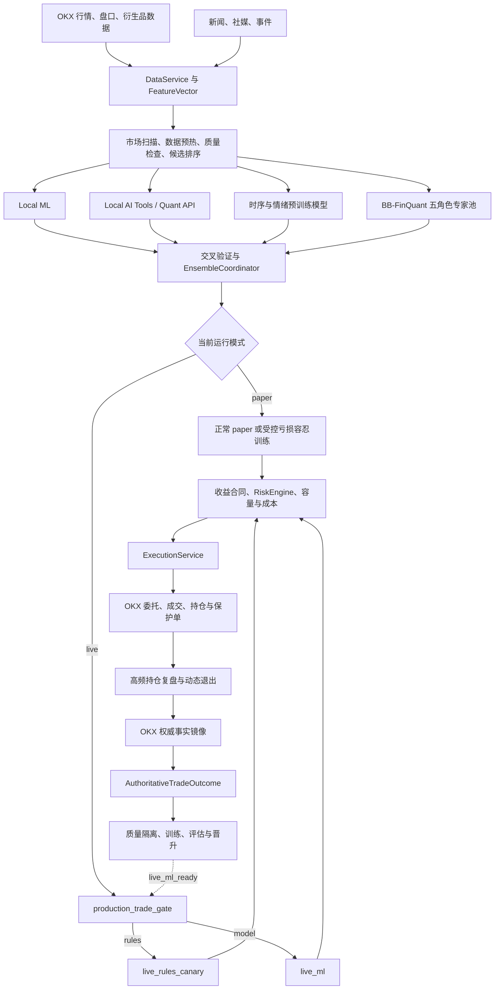
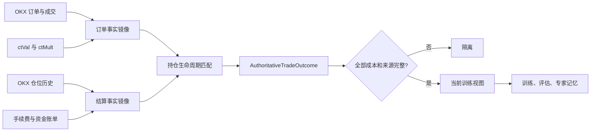
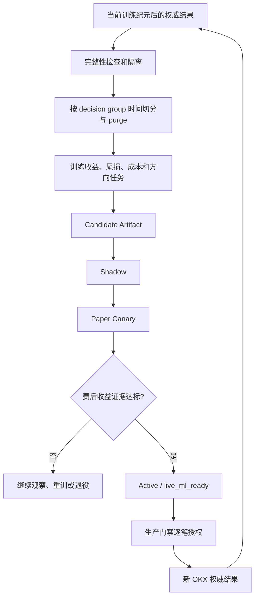
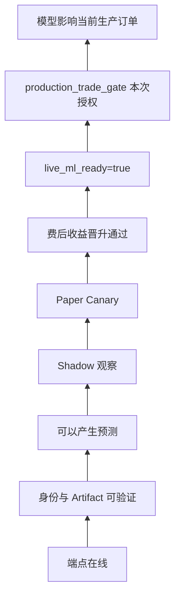
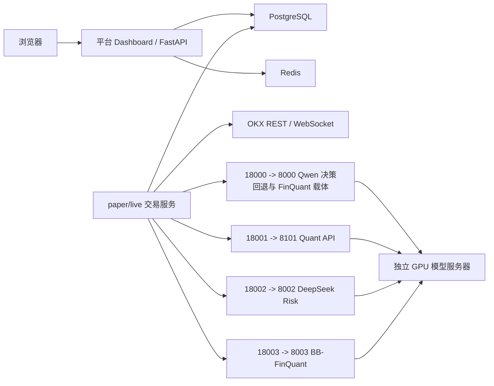

# BB 盈利闭环交易系统最新版说明

生成时间：2026-07-26 19:45（Asia/Shanghai）

业务代码基线：`ce737a6 Restore dashboard responsiveness`

文档审计前基线：`3ca3b83 docs: 重写最新版系统全景说明`

项目目录：`E:\code\bb`

## 1. 文档口径

本文只描述当前 `main` 代码和生成文档时的线上只读审计结果，包含：

- 当前完整业务逻辑；
- 模拟交易、生产交易、结算、训练和模型晋升闭环；
- 当前技术栈和部署结构；
- 当前实际接入、登记或部署的全部模型；
- 模型、规则、风控和交易权限之间的边界；
- 当前线上运行与数据状态。

本文把内容分成两类：

1. **稳定架构事实**：由当前代码决定，例如交易门禁、训练目标、模型清单和服务职责。
2. **运行快照**：由线上数据库和服务实时决定，例如结果数量、当前持仓和服务健康，必须附核验时间，不能当作长期常量。

## 2. 当前线上快照

本节来自 2026-07-26 19:45（Asia/Shanghai）执行的线上只读审计。该时间点之后的数据增长不代表文档错误，应重新运行 2.5 节的审计命令刷新。

### 2.1 交易与服务

| 项目 | 当前状态 |
| --- | --- |
| 线上交易模式 | `paper` |
| `bb-paper-trading.service` | `active/running` |
| `bb-dashboard.service` | `active/running` |
| 当前 30 分钟市场决策 | 17 条，覆盖 10 个币种 |
| 当前持仓 | 1 个 |
| 持仓复盘决策 | 31 条 |
| 候选覆盖 | 没有超期币种；2 个本轮应覆盖候选尚未完成分析 |

本次覆盖审计返回 `ready=false`，阻断项是当前 30 分钟覆盖窗口尚未完成，以及 2 个本轮应覆盖候选尚未完成分析。它是分析覆盖就绪度，不是交易开关；两个主服务均在运行，且没有超期币种。

### 2.2 最新权威训练结果

当前线上 `paper` 权威结果审计：

| 指标 | 当前值 |
| --- | ---: |
| 权威结果总数 | 516 |
| 事实和成本完整、可训练 | 59 |
| 事实不完整、继续隔离 | 457 |
| 可训练的亏损容忍 paper 训练结果 | 59 |
| 可训练的普通策略结果 | 0 |

当前 516 条结果按入场类型分为 400 条 `normal_strategy_trade` 和 116 条 `loss_tolerant_paper_training`。59 条完整可训练结果全部来自后者；普通策略结果当前仍没有满足完整训练合同。

457 条隔离结果的主要缺口仍包括：

- 成交价格路径与毛收益不一致；
- 缺少权威双边滑点；
- 缺少开仓或平仓成交事实；
- 缺少权威手续费、名义金额或精确订单关联；
- 一个持仓生命周期对应多个不完整开/平仓链；
- 旧策略交易缺少当前训练合同要求的责任和来源字段。

这些结果不能填默认值后强行训练。能从 OKX 官方事实补齐的继续重建；不能补齐的保留审计记录，但不进入训练和晋升。

权威结果合同版本：`2026-07-24.authoritative-trade-outcome.v3`。

### 2.3 “506 条结果”历史快照如何理解

用户之前看到的“506 条权威结果、57 条可训练、449 条隔离”是 2026-07-26 18:59（Asia/Shanghai）的历史快照，不是长期常量。

以当前训练纪元起点 2026-07-24 03:03:37（Asia/Shanghai）拆分该快照：

| 区间 | 权威结果 | 完整可训练 | 隔离 |
| --- | ---: | ---: | ---: |
| 当前训练纪元之前 | 355 | 9 | 346 |
| 当前训练纪元内 | 151 | 48 | 103 |
| 合计 | 506 | 57 | 449 |

因此，当时 57 条可训练结果并不全是重构后数据。按“进入当前训练纪元、且满足完整训练合同”的严格口径，重构后完整数据是 **48 条**；另外 9 条是旧纪元中仍能被权威事实完整证明的结果。到 19:45 的最新审计数字已经增长为 516 / 59 / 457，不能再用 48 去推断当前纪元的实时数量。

训练纪元是数据重建边界，不等于最后一次代码部署时间。若再按当时最终业务版本部署完成时间 2026-07-26 18:04:08（Asia/Shanghai）切分，506 条快照中只有 9 条在该时间后结算，其中 4 条完整、5 条隔离。这个“4”回答的是“精确在最终部署完成后结算的完整结果”，而“48”回答的是“当前训练纪元内的完整结果”，两个口径不能混用。

### 2.4 当前模型服务

| 项目 | 当前状态 |
| --- | --- |
| 模型服务器运行环境 | `runtime_ready=true` |
| GPU | 1 张 NVIDIA A100-SXM4-40GB |
| LLM 接口 | 3 个接口可用 |
| Quant API | `bb-phase3-quant-api.service active/running` |
| `qwen3-14b-trade` | 端口 8000，可用，shadow only |
| `BB-FinQuant-Expert-14B` | 端口 8003，可用，shadow only |
| `deepseek-r1-14b-risk` | 端口 8002，可用，shadow only |
| 模型生产路由 | `live_routing_enabled=false` |

准确含义是：模型和 Quant API 已经能提供推理或影子证据，但当前没有任何模型取得生产交易路由权。

### 2.5 刷新当前快照

静态文档中的数字会随交易继续变化。最新值应使用：

```powershell
.\.venv\Scripts\python.exe scripts/audit_authoritative_trade_outcomes.py --online --summary-only
.\.venv\Scripts\python.exe scripts/audit_online_analysis_coverage.py --allow-not-ready --timeout 180
.\.venv\Scripts\python.exe scripts/run_phase3_model_server_readiness_audit.py --stdout-only
```

## 3. 系统目标

系统面向 OKX 永续合约，目标是持续产生可追溯、成本完整的交易结果，并让训练、晋升、降级和交易权限统一受真实费后盈利能力约束。

唯一训练和晋升主目标是：

`net_return_after_all_cost_pct`

它必须包含：

- 开仓手续费；
- 平仓手续费；
- 资金费；
- 开仓滑点；
- 平仓滑点；
- OKX 官方 realized PnL；
- 可验证的数量、合约面值和名义金额。

准确率、AUC、方向胜率和模型置信度只用于诊断。它们不能单独让模型晋升，也不能授予生产交易权。

## 4. 总体架构



系统不是“LLM 给出方向后直接下单”。模型负责产生证据和候选；确定性协调器、生产门禁、收益合同、硬风控、账户事实和执行合同共同决定是否能下单。

## 5. 运行入口与服务职责

### 5.1 入口

| 场景 | 入口 |
| --- | --- |
| OKX demo/paper 交易 | `scripts/run_paper_trading.py` |
| OKX live 交易 | `scripts/run_live_trading.py` |
| Dashboard | `scripts/run_dashboard.py` |

### 5.2 核心服务

| 模块 | 当前职责 |
| --- | --- |
| `services/data_service.py` | 采集行情、K 线、盘口、衍生品、新闻和事件，生成特征 |
| `services/trading_service.py` | 交易主编排、候选分析、模型上下文、执行和持仓复盘 |
| `ai_brain/model_registry.py` | 固定专家注册、批量调用、超时和失败降级 |
| `ai_brain/cross_validator.py` | 专家意见交叉验证和证据结构化 |
| `ai_brain/ensemble_coordinator.py` | 确定性汇总多源意见，形成候选决策 |
| `services/production_trade_gate.py` | 唯一生产开仓授权合同 |
| `risk_manager/engine.py` | 硬风险、风险预算和账户风险裁决 |
| `services/execution_service.py` | 串行提交、幂等订单、成交确认和执行持久化 |
| `services/dynamic_exit_policy.py` | 费后持仓经济性和动态退出比例 |
| `services/sync_service.py` | 当前 OKX 账户、仓位、余额和保护单同步 |
| `services/okx_order_fact_sync.py` | OKX 订单、成交和合约规格事实 |
| `services/okx_settlement_fact_sync.py` | OKX 仓位历史和资金账单镜像 |
| `services/okx_position_settlement_sync.py` | 最终仓位结算和训练结果写入 |
| `services/ml_signal_service.py` | Local ML 训练、推理、Artifact 和晋升评估 |
| `services/model_training_registry.py` | 全部模型的统一身份、生命周期和权限视图 |
| `web_dashboard/` | 交易、持仓、训练、模型、审计和运维界面 |

## 6. 交易业务逻辑

### 6.1 数据采集和特征

`DataService` 使用 OKX WebSocket/REST 和外部事件源形成 `FeatureVector`，主要包括：

- 多周期价格、收益率和技术指标；
- 成交量、趋势、波动和异常 K 线；
- 资金费率、基差、持仓量等衍生品数据；
- 订单簿深度、价差、流动性和冲击成本；
- 新闻、社媒和事件情绪；
- 多周期序列；
- 来源、时间戳、新鲜度和质量状态。

缺失或过期的关键事实不能补成有利于开仓的默认值。数据不完整时，系统延后候选、降级观察或阻断执行。

### 6.2 扫描和候选排序

每轮主循环依次完成：

1. 获取当前可交易市场；
2. 预热 K 线和盘口；
3. 检查数据质量与新鲜度；
4. 生成初步机会；
5. 检查已有仓位和候选覆盖队列；
6. 对有限候选排序；
7. 只让排名靠前且事实完整的候选进入模型分析。

候选覆盖队列会保留本轮因特征未就绪、调度冲突或模型未返回而延后的币种，避免少数反复失败的币种长期饿死其他市场。

### 6.3 多模型分析

候选进入完整分析后，系统并行或批量读取：

- Local ML 的多空胜负、净收益、尾损和执行成本；
- Quant API 的收益、亏损概率、时序、情绪和退出证据；
- TimesFM、Chronos、FinBERT 等预训练专家证据；
- 五个固定 LLM 专家角色；
- 历史策略复盘和向量记忆上下文；
- 当前账户、仓位和风险事实。

固定专家角色：

| 配置名 | 职责 |
| --- | --- |
| `trend_expert` | 行情方向 |
| `momentum_expert` | 费后盈利质量 |
| `sentiment_expert` | 短线时序和事件冲击 |
| `position_expert` | 已有持仓的持有、减仓和平仓 |
| `risk_expert` | 异常波动、流动性和硬风险提示 |

当前线上配置把这五个角色统一路由到 `BB-FinQuant-Expert-14B`。五个角色是五种提示词职责，不是五个独立模型证据源。

`EnsembleCoordinator` 调用专家时明确排除 `decision_maker`，再由 `combine()` 用确定性代码形成最终候选。`decision_maker` 仍有配置和服务槽位，但当前主汇总不允许它覆盖最终交易结果。

### 6.4 当前 paper 训练逻辑

当前线上运行的是 `paper`。当正常费后盈利合同尚未形成时，系统允许生成受控的亏损容忍训练交易，用真实 OKX demo 成交学习盈利和亏损。

当前 `services/paper_training.py` 的准确合同是：

- 只允许 `paper`；
- `production_permission=false`；
- 必须有明确的 `long` 或 `short` 方向；
- 方向竞争必须给出有效分数，且所选方向必须优于有分数的反方向；
- 必须有正数预测时间窗；
- 至少有 1 个带收益预测和时间窗的模型观测，声明数量必须与可审计来源一致；
- 至少有 3 个具备有效动作、推理文本和非零有效权重的可审计专家结果；
- 支持通道至少 2 个，且支持通道数必须大于反对专家通道数；
- 不要求当前预测收益已经为正；
- 不要求模型已经晋升或取得 `live_ml_ready`；
- `loss_tolerant_for_training=true`；
- 单笔风险上限为账户权益的 `0.01%`；
- 组合风险上限为账户权益的 `0.03%`；
- 不设置每日样本配额；
- 不创建独立于正常交易的采样订单；
- 使用稳定的 `BBPT` client order ID；
- 成交后绑定预测时间窗；
- 时间窗到期后强制进入结算退出；
- 盈利和亏损都进入权威结果构建。

这里的支持通道数等于“可审计模型来源数 + 与所选方向一致的专家数”，反对通道数等于反向专家数。至少 3 个专家指 3 个可审计专家结果，不要求 3 个专家全部同向；`hold` 可以计入专家完整性，但不计入方向支持。

这组条件说明了两个不同边界：**模型没有晋升仍可参与受控 paper 训练，但没有足够真实分析证据时不能开仓**。晋升决定模型能否影响生产交易，不负责取消 paper 训练的分析质量门槛。

### 6.5 生产交易门禁

生产开仓只能接受 `services/production_trade_gate.py` 当前版本：

`2026-07-24.profit-loop-trade-gate.v3`

门禁输出：

| 模式 | 下生产单 | 决策责任 | 模型影响 |
| --- | --- | --- | --- |
| `blocked` | 否 | `none` | 否 |
| `observe` | 否 | `none` | 否 |
| `live_rules_canary` | 是，小仓 | `rules` | 否 |
| `live_ml` | 是 | `model` | 是 |

默认规则金丝雀限制：

- 最大名义金额 `10 USDT`；
- 最多 `1` 个持仓；
- 单日最大亏损 `3 USDT`。

进入 `live_ml` 必须同时满足：

- `live_ml_ready=true`；
- 模型费后期望收益为正；
- 收益置信下界 LCB 为正；
- Profit Factor 大于 1；
- 生产样本数达到配置要求，默认至少 30；
- OKX live 凭据、账户和新开仓状态健康；
- 当前风险、持仓数和当日亏损未触发阻断。

门禁版本、模式、责任方或 `model_can_influence` 不一致时，执行服务必须失败关闭。

当前线上仍是 `paper`，模型 `live_routing_enabled=false`。代码具备规则金丝雀和模型生产模式，不代表当前线上已经启用它们。

### 6.6 入场合同和风险

一个候选要进入执行，还必须通过：

1. 数据和价格新鲜度；
2. 当前模式对应的 paper 或生产合同；
3. 动态费后收益和执行成本证据；
4. `RiskEngine` 的账户和组合风险预算；
5. 当前容量、集中度和已有仓位检查；
6. OKX 余额、保证金、合约规格和最小下单单位；
7. 稳定订单身份和执行来源证据。

LLM 置信度不能绕过这些检查。

### 6.7 订单执行

`ExecutionService` 负责：

- 串行化开仓和关键平仓动作；
- 生产订单再次校验唯一门禁；
- 获取最新 OKX 私有事实；
- 生成幂等 client order ID；
- 提交订单并等待成交确认；
- 记录委托、成交、失败原因和延迟；
- 更新订单、持仓、决策阶段和 Dashboard。

paper 决策不继承生产门禁，避免把训练交易误记成模型生产责任。

### 6.8 持仓和退出

持仓由独立高频循环复盘。执行优先级：

1. 硬止损和硬止盈；
2. paper 训练预测时间窗到期；
3. 当前持仓费后未实现收益；
4. 盈利回撤和止损预算消耗；
5. 行情延续、反向压力和流动性；
6. 更强替代机会；
7. 模型建议平仓比例；
8. 组合集中度和容量占用。

硬风险或 paper 训练时间窗到期时全平；其他情况可继续持有或部分减仓。退出判断使用包含费用缓冲的净 PnL，不只看毛浮盈。

## 7. OKX 权威事实与结算

### 7.1 四条职责链

| 服务 | 职责 |
| --- | --- |
| `OkxSyncService` | 当前账户、余额、仓位、保护单 |
| `OkxOrderFactSyncService` | 订单、成交、保护成交、合约规格 |
| `OkxSettlementFactSyncService` | 官方仓位历史和资金账单镜像 |
| `OkxPositionSettlementSyncService` | 用本地权威镜像形成最终仓位结算和训练结果 |

### 7.2 权威结果链



训练结果至少需要：

- 开仓和平仓订单 ID；
- 开仓和平仓成交事实；
- 方向、数量、合约面值、名义金额；
- 开仓费、平仓费、资金费；
- 双边权威滑点；
- OKX 官方 realized PnL；
- 持仓时间；
- 交易类型和决策责任；
- 模型旁路方向；
- 证据指纹；
- `net_return_after_all_cost_pct`。

缺少上述事实时，结果可以保留用于审计，但不能进入当前训练和模型晋升。

### 7.3 训练纪元

`data/training_epoch.json` 是当前派生训练层的唯一时间边界。可以清理和重建：

- 影子样本；
- 复盘和专家记忆；
- 模型 Artifact；
- 训练 cursor 和 scheduler state；
- 向量索引；
- Dashboard 派生缓存。

不能删除：

- OKX 订单和成交；
- 仓位和仓位历史；
- 手续费和资金费；
- realized PnL；
- 原始审计和证据指纹。

## 8. 训练与晋升闭环



### 8.1 盈利和亏损如何学习

- 盈利样本学习可重复的费后收益条件；
- 亏损样本学习错误方向、尾损、成本侵蚀和退出失败；
- paper 训练结果归责为 `system` 训练来源，不冒充模型生产责任；
- 规则生产交易归责给 `rules`；
- 模型旁路支持亏损方向时形成负面模型证据；
- 模型旁路避开亏损方向时形成正面模型证据；
- 只有 `decision_authority=model` 的生产结果才是模型实盘责任。

### 8.2 晋升指标

晋升主要检查：

- `net_return_after_all_cost_pct` 分布；
- 收益 LCB；
- Profit Factor；
- 尾部亏损；
- 最大回撤；
- long/short 分方向表现；
- 样本量和时间覆盖；
- walk-forward 和独立测试窗口；
- OKX 权威事实完整性；
- 数据集、代码和 Artifact 哈希。

`live_ml_ready` 是唯一模型生产授权字段，但它仍不是逐笔下单许可。最终每一笔生产订单还要重新经过 `production_trade_gate`。

## 9. 当前全部模型

本节按实际状态区分模型：

- **在线推理服务**：端点和身份已由线上只读审计验证；
- **本地可训练模型**：代码能训练并持久化 Artifact，但 Artifact 是否晋升必须单独判断；
- **预训练影子专家**：模型文件和适配器存在，用于推理、对比或评估，不具备生产交易权；
- **仅登记或仅下载**：保留身份、依赖或文件，不代表当前主交易链正在调用。

因此，“全部模型”是完整资产和实现清单，不等于每个模型都在每一轮市场分析中执行，也不等于其中任何模型已经取得生产交易权。

### 9.1 大语言模型

| 模型 | 来源/基座 | 当前用途 | 当前线上状态 | 生产交易权 |
| --- | --- | --- | --- | --- |
| `BB-FinQuant-Expert-14B` | Qwen3-14B + 项目 LoRA | 五角色量化专家池 | 8003，ready，shadow only | 无 |
| `qwen3-14b-trade` | `Qwen/Qwen3-14B-AWQ` | 决策回退和 FinQuant 载体 | 8000，ready，shadow only | 无 |
| `deepseek-r1-14b-risk` | `casperhansen/deepseek-r1-distill-qwen-14b-awq` | 独立高风险复核服务 | 8002，ready，shadow only | 无 |
| `deepseek_online_decision` | 外部托管 DeepSeek | 可选在线决策登记身份 | 由加密运行配置决定 | 无直接授权 |

#### BB-FinQuant-Expert-14B

- 当前验证版本：`20260712T094555Z-4f40bc0974e6`；
- 训练样本：512；
- 基座训练来源：`Qwen/Qwen3-14B`；
- 推理载体：`Qwen/Qwen3-14B-AWQ`；
- 训练阶段：SFT 格式/领域训练 + TRL DPO 收益偏好；
- 目标：最大化真实费后净收益；
- 当前身份和 Adapter 哈希验证通过；
- 当前仍是 `shadow_candidate_not_live`。

#### deepseek-r1-14b-risk

模型服务在线，但 `services/entry_high_risk_review.py` 当前只写入：

- `read_only=true`；
- `production_permission=false`；
- 专家分歧和 ML/AI 方向冲突上下文。

它当前不能批准、否决或绕过订单。硬风险实际由 `RiskEngine`、收益合同和执行合同掌权。

#### 外部在线 DeepSeek

模型登记表保留 `deepseek_online_decision` 身份，具体模型名和端点由加密运行配置注入。它不属于本次模型服务器三个本地 LLM 接口的确认范围，不能把“登记存在”写成“当前一定正在主交易链调用”。

### 9.2 Local ML 盈利质量模型包

登记 ID：`local_ml_profit_quality`

实现：`services/ml_signal_service.py`

一个 Artifact 包含 8 条 sklearn Pipeline：

| Pipeline | 任务 |
| --- | --- |
| `long_classifier` | 做多胜负分类 |
| `short_classifier` | 做空胜负分类 |
| `long_tail_classifier` | 做多尾部亏损概率 |
| `short_tail_classifier` | 做空尾部亏损概率 |
| `long_regressor` | 做多净收益回归 |
| `short_regressor` | 做空净收益回归 |
| `long_cost_regressor` | 做多执行成本回归 |
| `short_cost_regressor` | 做空执行成本回归 |

实现参数：

- `SimpleImputer(strategy="median")`；
- `RandomForestClassifier` / `RandomForestRegressor`；
- 220 棵树；
- 最大深度 8；
- 叶节点最少 8 个样本；
- 随机种子 42；
- 单一类别使用 `DummyClassifier(strategy="prior")`；
- 常数目标使用 `DummyRegressor(strategy="mean")`；
- 按 decision group 做时间切分和 purge。

### 9.3 Local AI Tools / Quant API

| 槽位 | 当前算法 | 任务 |
| --- | --- | --- |
| `profit` | 多空 `ExtraTreesRegressor` | 市场机会/收益预测 |
| `execution_cost` | 多空 `ExtraTreesRegressor` | 反事实执行成本 |
| `loss_filter` | 分方向 `ExtraTreesClassifier` | 亏损概率 |
| `timeseries` | 分周期、分方向 `ExtraTreesRegressor` | 多时间窗收益分布 |
| `deep_timeseries` | 序列 ExtraTrees；可选 PyTorch 两层 MLP | 序列收益预测 |
| `sentiment` | 分方向 `RandomForestRegressor` | 情绪收益校准 |
| `deep_sentiment` | TF-IDF + `Ridge` | 文本事件收益校准 |
| `exit` | 交易画像 + 实时 PnL 规则 | 退出归因，不是独立神经网络 |

这些是 Quant API Artifact 中的实现槽位。某个槽位训练样本不足时可以没有独立 Artifact 或使用显式退化实现；不能仅凭服务在线就断言每个槽位已经完成训练或晋升。

ExtraTrees 当前主要参数：

- 回归 260 棵树，最大深度 12；
- 分类 240 棵树，最大深度 12；
- 叶节点下限随样本数动态计算；
- 训练并行度按 CPU 数量开平方，给实时推理保留余量。

代码中的“PatchTST/TFT-style”只表示序列输入组织方式。当前可选 Torch 实现是两层 MLP，不是正式 PatchTST 或 TFT 架构。

### 9.4 预训练时序和情绪模型

| 模型 | 当前角色 | 当前权限 |
| --- | --- | --- |
| `google/timesfm-2.5-200m-pytorch` | 主时序专家 | 推理/影子证据，无生产权 |
| `amazon/chronos-2` | 时序挑战者 | 影子对比，无生产权 |
| `ProsusAI/finbert` | 主金融文本情绪专家 | 推理/影子证据，无生产权 |
| `yiyanghkust/finbert-tone` | 情绪挑战者 | 影子对比，无生产权 |

情绪模型输出不能直接等同于做多或做空，仍需经过项目自己的收益校准和交易合同。

### 9.5 已下载、已登记或有依赖但当前不参与实际推理

- `ibm-granite/granite-timeseries-ttm-r2`：文件已下载，但 `timeseries_fallback` 不在 `IMPLEMENTED_SPECIALIST_ADAPTERS`；
- CryptoBERT / `ElKulako/cryptobert`：只出现在准备或偏好配置描述中，当前不是已安装运行模型；
- XGBoost：依赖存在，当前主链没有实例化 XGBoost 模型；
- DeepSeek 32B 脚本：历史部署/迁移工具，不是当前三期 14B 运行槽；
- Backtrader：回测框架，不是预测模型；
- `DummyClassifier` / `DummyRegressor`：小样本退化基线，不是独立交易策略。

## 10. 不是模型但会影响交易的组件

| 组件 | 类型 | 权限 |
| --- | --- | --- |
| `EnsembleCoordinator` | 确定性协调器 | 汇总证据，不授予生产权 |
| `production_trade_gate` | 生产门禁 | 唯一生产开仓授权入口 |
| `RiskEngine` | 硬风险规则 | 可阻断或缩减交易 |
| `live_rules_canary_signal` | 规则策略 | 规则金丝雀模式下决定方向 |
| `dynamic_exit_policy` | 确定性退出策略 | 决定持有、减仓、全平 |
| 机会排序和容量控制 | 确定性调度 | 限制候选和暴露 |
| 向量记忆 embedding | 本地确定性文本向量 | 只检索历史上下文 |
| Dashboard 审计 | 只读诊断 | 不能开仓、晋升或绕过风控 |

## 11. 模型权限层级



不能跳级：

- 服务在线不等于训练完成；
- 训练完成不等于数据正确；
- Artifact 存在不等于真实盈利；
- 影子准确率高不等于费后收益合格；
- `live_ml_ready` 也不能绕过逐笔账户、风险和成本检查。

## 12. 技术栈

### 12.1 应用层

| 类别 | 技术 |
| --- | --- |
| 语言 | Python；Black、Ruff、Mypy 的项目目标版本为 3.11（`py311`） |
| 异步 | `asyncio` |
| API | FastAPI、Uvicorn、Pydantic |
| 页面 | Jinja2、原生 JavaScript/CSS |
| 实时推送 | WebSocket |

### 12.2 数据与基础设施

| 类别 | 技术 |
| --- | --- |
| ORM | SQLAlchemy Async |
| 数据库迁移 | Alembic |
| 线上数据库 | PostgreSQL + asyncpg |
| 本地数据库 | SQLite + aiosqlite |
| 消息/缓存 | Redis pub/sub |
| 交易所 | CCXT、python-okx |
| 网络 | HTTPX、websockets |
| 远程运维 | Paramiko、SSH 隧道 |
| 向量存储 | zvec |

### 12.3 数据科学与模型

| 类别 | 技术 |
| --- | --- |
| 数据处理 | pandas、NumPy |
| 技术指标 | `ta` |
| 传统 ML | scikit-learn |
| 深度学习 | PyTorch |
| 模型加载 | Transformers、Accelerate |
| 预训练时序 | TimesFM、Chronos |
| LLM 客户端 | OpenAI SDK、LangChain |
| LLM 推理 | vLLM |
| 微调 | PEFT、TRL、datasets |
| 回测 | Backtrader |

### 12.4 工程质量

- pytest、pytest-asyncio；
- Ruff；
- Mypy；
- Black；
- systemd；
- 结构化日志、Tenacity 重试和运行时文本清洗。

### 12.5 运行环境边界

线上不是一个 Python 进程承载全部功能：

| 环境 | 主要职责 |
| --- | --- |
| 平台应用虚拟环境 | 交易主循环、Dashboard、同步、结算、训练调度和审计脚本 |
| `trade_vllm` Conda 环境 | Qwen、FinQuant Adapter 和 DeepSeek 的 vLLM 推理进程 |
| `/data/BB/envs/phase3-quant` | Quant API、传统 ML、时序和情绪专家 |

`pyproject.toml` 中的 `py311` 是代码兼容和静态工具目标，不应被解释成所有线上隔离环境都必然使用同一个 Python 小版本。部署事实应以各 systemd 单元的实际解释器和虚拟环境为准。

## 13. 部署结构



平台 systemd 服务：

- `bb-paper-trading.service`；
- `bb-dashboard.service`；
- `bb-model-tunnels.service`。

模型服务器 systemd 服务：

- `bb-phase3-llm-decision.service`；
- `bb-phase3-llm-expert.service`；
- `bb-phase3-llm-risk-review.service`；
- `bb-phase3-quant-api.service`。

## 14. Dashboard 最新实现

当前 `95d29f7` 和 `ce737a6` 两个连续提交优化了 Dashboard 响应性：

- 决策列表使用 `DecisionSummary` 只读取页面需要的列；
- 大型 `raw_llm_response` 不再整列加载，只投影展示需要的 JSON 键；
- 订单列表只选择决策页面需要的订单字段；
- 浏览器对同一 URL 的并发 GET 请求进行去重；
- 数据采集状态接口把 CPU 较重的数据库审计段改为串行执行，避免单个 Dashboard worker 被并行计算拖慢；
- 训练治理和特征覆盖等可能变慢的观察段继续保留超时保护；
- 模型训练状态继续通过 `/api/model-training/registry` 和 scheduler 接口统一读取。

这些修改只优化读取路径，不改变交易、训练、门禁或模型权限。

## 15. 关键结论

1. 当前线上是 OKX demo/paper 训练系统，不是模型实盘系统。
2. 2026-07-26 19:45 的权威结果快照是 516 条，其中 59 条可训练、457 条继续隔离；这些数字会继续变化。
3. 59 条可训练结果全部来自受控亏损容忍 paper 训练，普通策略结果目前没有达到当前训练合同。
4. 模型服务器和 Quant API 已经在线，但 `live_routing_enabled=false`，模型没有生产交易权。
5. 当前 paper 训练不要求模型先晋升，也不要求预测收益先为正；但仍要求至少 3 个可审计专家结果、至少 2 个支持通道、明确方向和时间窗、完整合同及极小风险。
6. 唯一训练目标是 `net_return_after_all_cost_pct`，准确率只能诊断。
7. 事实不完整的数据必须隔离，不能用默认值伪造训练样本。
8. 生产交易只接受当前 `production_trade_gate`，模型、Dashboard 和审计都不能绕过它。

## 16. 主要源码索引

| 主题 | 文件 |
| --- | --- |
| 交易主循环 | `services/trading_service.py` |
| 数据与特征 | `services/data_service.py` |
| 固定专家配置 | `config/settings.py` |
| 专家调用 | `ai_brain/model_registry.py` |
| 专家交叉验证 | `ai_brain/cross_validator.py` |
| 确定性汇总 | `ai_brain/ensemble_coordinator.py` |
| paper 训练 | `services/paper_training.py` |
| 生产门禁 | `services/production_trade_gate.py` |
| 订单执行 | `services/execution_service.py` |
| 动态退出 | `services/dynamic_exit_policy.py` |
| 当前 OKX 同步 | `services/sync_service.py` |
| OKX 订单事实 | `services/okx_order_fact_sync.py` |
| OKX 结算事实 | `services/okx_settlement_fact_sync.py` |
| 最终仓位结算 | `services/okx_position_settlement_sync.py` |
| 权威结果 | `services/authoritative_trade_outcome.py` |
| 训练质量 | `services/training_data_quality.py` |
| Local ML | `services/ml_signal_service.py` |
| 模型晋升 | `services/model_promotion_policy.py` |
| 模型统一登记 | `services/model_training_registry.py` |
| 高风险复核入口 | `services/entry_high_risk_review.py` |
| Quant API 模型 | `scripts/deploy_local_ai_tools_service.py` |
| LLM 服务部署 | `scripts/deploy_phase3_model_server_services.py` |
| FinQuant 训练 | `scripts/finquant_expert_lora_training.py` |
| 模型隧道 | `scripts/start_online_model_tunnels.py` |
| Python 工具目标 | `pyproject.toml` |
| 依赖清单 | `requirements.txt` |
| Dashboard API | `web_dashboard/api/dashboard.py` |
| 数据采集状态 API | `web_dashboard/api/data_collection.py` |
| 决策摘要读取 | `db/repositories/decision_repo.py` |
