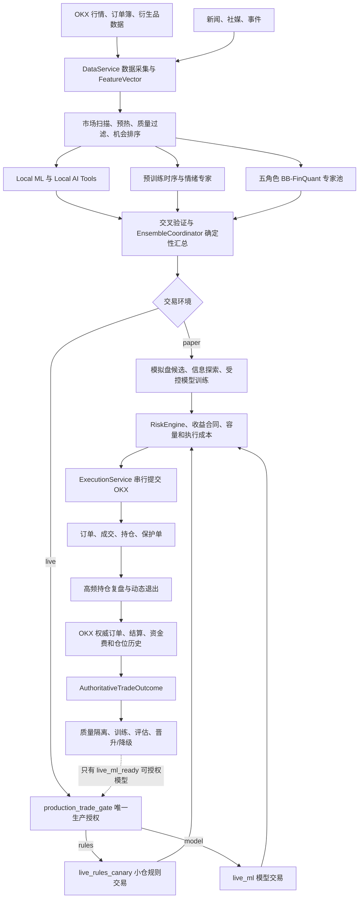
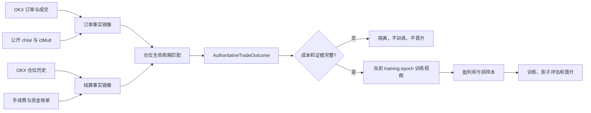
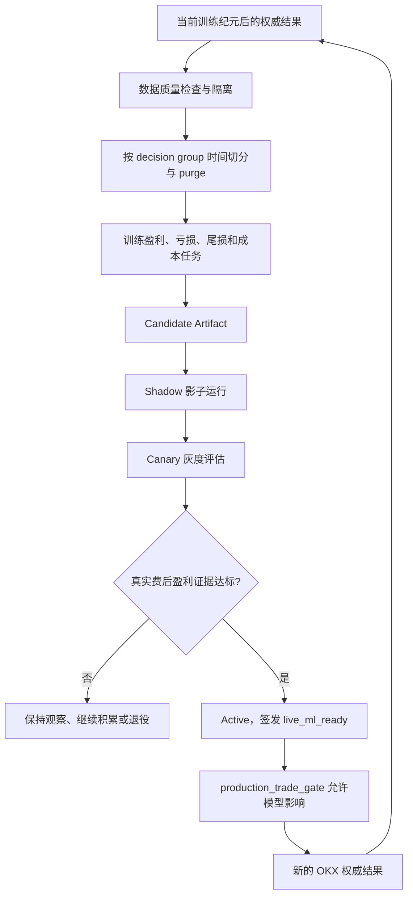
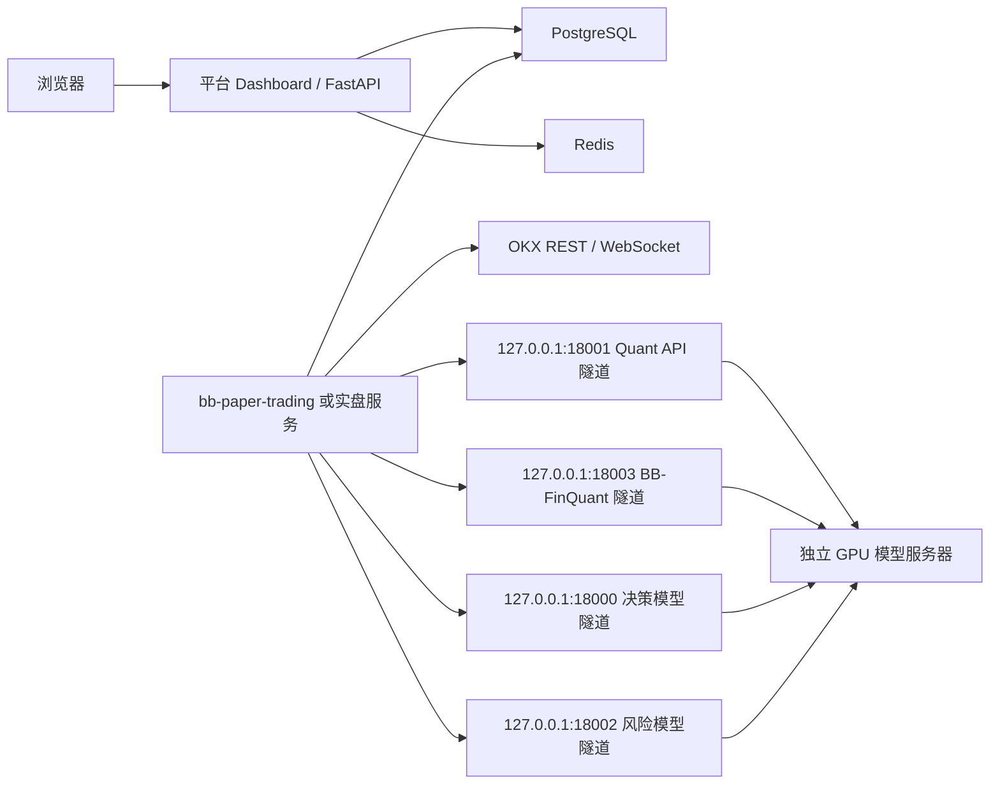
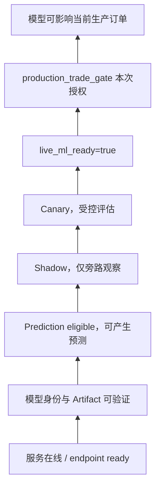

# BB 盈利闭环交易系统全景说明

日期：2026-07-26

代码基线：`6a944c6 restore controlled paper model training`

项目根目录：`E:\code\bb`

## 1. 文档定位

本文说明当前代码实际实现的：

- 整体业务逻辑；
- 交易、结算、训练和模型晋升闭环；
- 技术栈和部署结构；
- 所有实际接入的模型、算法及其权限；
- 当前数据和运行状态；
- 容易混淆但并不是模型的组件。

本文描述的是当前实现，不把计划中的能力写成已完成能力，也不把“模型服务在线”等同于“模型已获得生产交易权”。

## 2. 系统一句话定义

这是一个面向 OKX 永续合约的异步量化交易系统：它采集行情和外部事件，组合规则、传统机器学习、预训练时序/情绪模型和大语言模型形成候选交易，通过统一生产门禁和硬风控执行订单，再以 OKX 权威成交事实计算包含全部成本的真实净收益，用这些结果训练、评估和晋升模型。

系统的唯一训练和晋升主目标是：

`net_return_after_all_cost_pct`

准确率、AUC、方向胜率等指标只用于诊断，不能单独授予模型生产交易权。

## 3. 总体业务架构

系统不是“一个模型直接下单”。模型只提供证据或候选，真正可执行的订单还必须通过收益、风险、账户、成本、容量和生产权限合同。

## 4. 运行入口和服务边界

### 4.1 运行入口

| 场景 | 入口 | 作用 |
| --- | --- | --- |
| 模拟交易 | `scripts/run_paper_trading.py` | 运行 OKX demo/paper 交易、样本生成和持仓管理 |
| 实盘交易 | `scripts/run_live_trading.py` | 运行生产交易，必须经过生产门禁 |
| Dashboard | `scripts/run_dashboard.py` | 启动管理界面、API、WebSocket 和系统审计 |

### 4.2 核心职责

| 模块 | 当前职责 |
| --- | --- |
| `services/data_service.py` | 行情、K 线、订单簿、衍生品、新闻和事件采集，生成特征快照 |
| `services/trading_service.py` | 交易主循环、市场扫描、候选分析、模型调用、持仓复盘和阶段编排 |
| `ai_brain/model_registry.py` | 固定专家注册、并发/批量调用、失败降级和调用记录 |
| `ai_brain/cross_validator.py` | 专家交叉验证和证据结构化 |
| `ai_brain/ensemble_coordinator.py` | 用确定性逻辑汇总专家、ML 和上下文，输出候选决策 |
| `services/production_trade_gate.py` | 唯一生产开仓授权入口，决定交易模式和决策责任方 |
| `services/risk_engine.py` | 硬风险裁决，不由语言模型替代 |
| `services/execution_service.py` | 串行执行、幂等订单、成交确认和执行结果持久化 |
| `services/dynamic_exit_policy.py` | 持仓经济性、回撤、风险消耗和替代机会驱动的退出比例 |
| `services/okx_*sync*.py` | OKX 当前事实、订单事实、结算事实和最终仓位结算 |
| `services/ml_signal_service.py` | 本地 ML 训练、推理、Artifact 和收益晋升评估 |
| `services/model_training_registry.py` | 统一发布所有模型的真实生命周期、Artifact、评估和权限状态 |
| `web_dashboard/` | 交易状态、训练状态、模型状态、审计和运维界面 |

## 5. 完整交易业务逻辑

### 5.1 数据采集和特征生成

`DataService` 从 OKX WebSocket/REST 获取实时和历史数据，并接入新闻、社媒和事件来源。形成的 `FeatureVector` 主要包含：

- 多周期价格和技术指标；
- 成交量、趋势、波动率和异常 K 线；
- 永续合约资金费率、基差、持仓量等衍生品信息；
- 订单簿深度、价差、流动性和冲击成本；
- 新闻、事件和社媒情绪；
- 面向时序模型的多周期序列；
- 数据来源、时间戳、新鲜度和质量状态。

缺失或过期数据不能静默补成有利于开仓的默认值。关键事实不完整时，候选必须降级为观察或被阻断。

### 5.2 市场扫描和候选排序

主循环不会对所有币种无限调用模型。它先完成：

1. 自动扫描可交易标的；
2. K 线和盘口预热；
3. 数据质量与新鲜度检查；
4. 初步机会计算；
5. 容量和已有仓位检查；
6. 对有限候选进行排序；
7. 只让排名靠前且数据完整的候选进入昂贵分析阶段。

这层负责节省延迟和模型资源，不拥有最终生产授权。

### 5.3 多源分析和确定性汇总

候选进入分析阶段后，系统并行收集：

- 本地 ML 的多空胜负、净收益、尾部亏损和执行成本预测；
- Local AI Tools 的收益、亏损、时序、情绪和退出证据；
- TimesFM、Chronos、FinBERT 等预训练专家证据；
- 向量记忆中的历史复盘上下文；
- 五个固定 LLM 专家角色的结构化意见。

五个固定专家角色是：

| 配置名 | 中文职责 | 主要边界 |
| --- | --- | --- |
| `trend_expert` | 行情方向专家 | 判断短线方向，不负责仓位和生产授权 |
| `momentum_expert` | 盈利质量专家 | 判断费后收益、亏损概率、盈亏比和左尾风险 |
| `sentiment_expert` | 短线时序专家 | 判断 1/5/10/30 分钟方向、延续和事件冲击 |
| `position_expert` | 持仓退出专家 | 只处理已有仓位的持有、减仓和平仓建议 |
| `risk_expert` | 异常风控专家 | 识别流动性、极端波动、交易所和数据异常 |

当前线上路由把这五个角色统一交给 `BB-FinQuant-Expert-14B`。因此它们虽然输出五份角色意见，但在证据独立性计算中属于同一个提供商证据源，不能被误算成五个独立模型投票。

交叉验证后，`EnsembleCoordinator.combine()` 用确定性代码汇总所有意见。`decision_maker` 已从主专家执行集合和最终覆盖链中移除；它的模型槽仍用于配置、健康检查或回退身份，但不能强制改写主交易结果。

### 5.4 开仓前合同

一个方向候选还必须依次满足：

1. 数据和价格仍然新鲜；
2. 费后预期收益证据完整；
3. 收益置信下界和执行成本满足当前动态合同；
4. `RiskEngine` 给出的风险预算可接受；
5. 当前持仓容量、方向集中度和相关性可接受；
6. OKX 私有账户、余额、保证金和合约规格事实可用；
7. 名义金额满足风险上限和 OKX 最小合约要求；
8. 实盘订单具有当前版本的唯一 `production_trade_gate`。

固定 ADX、成交量阈值等旧式静态生产门槛已经不再是主授权来源。当前合同要求动态费后收益、实时成本、风险预算和完整来源证据，缺失时失败关闭。

### 5.5 交易模式和权限

生产门禁输出四种状态：

| 模式 | 是否下生产单 | 决策权 | 模型影响 |
| --- | --- | --- | --- |
| `blocked` | 否 | 无 | 无 |
| `observe` | 否 | 无 | 只观察 |
| `live_rules_canary` | 是，小仓 | 规则 | 模型只能旁路记录 |
| `live_ml` | 是 | 已晋升模型 | 模型可参与生产决策 |

`live_rules_canary` 的默认安全边界为：

- 最大名义金额：`10 USDT`；
- 最大同时持仓：`1`；
- 单日最大亏损：`3 USDT`；
- 模型生产影响：`false`。

实盘只有两种合法的开仓责任组合：

- `live_rules_canary + decision_authority=rules + model_can_influence=false`；
- `live_ml + decision_authority=model + model_can_influence=true`。

任何旧版本门禁、缺字段门禁或权责不一致的门禁都必须拒绝执行。

### 5.6 模型晋升前如何继续交易和训练

模型没有晋升时，系统并不要求完全停摆。当前有三类模拟盘开仓来源：

1. 正常费后收益合同合格的候选；
2. paper 小风险信息探索；
3. paper 冷启动受控模型训练。

`services/paper_training.py` 的受控模型训练只允许 `paper`，并明确写入 `production_permission=false`。它不要求模型已经证明正收益，但要求：

- 有完整的模型方向观察；
- 至少 3 个可审计专家意见；
- 至少 2 个支持通道；
- 支持通道数量多于反对通道；
- 单笔风险不超过账户权益的 `0.01%`；
- 组合风险不超过账户权益的 `0.03%`；
- 订单绑定稳定的 OKX client order ID；
- 到达模型预测时间窗后强制结算。

盈利和亏损都会形成权威结果。这个路径用于获取学习样本，不代表模型拥有实盘权限。

### 5.7 订单执行

`ExecutionService` 负责：

- 串行提交，避免并发重复开仓；
- 执行前重新核对生产门禁；
- 重新读取 OKX 账户和价格事实；
- 生成稳定、可追踪的 client order ID；
- 提交订单并等待成交确认；
- 记录委托、成交、失败和延迟；
- 写入订单、持仓、决策阶段和 Dashboard 状态。

模拟交易不会读取或继承生产门禁，避免 paper 样本被错误归责为模型生产交易。

### 5.8 持仓管理和动态退出

持仓由独立高频循环复盘，不必等待下一轮完整市场扫描。执行顺序是：

1. 先检查硬止损、硬止盈和交易所保护事实；
2. 再计算费后未实现 PnL；
3. 评估盈利回撤、止损预算消耗和行情延续；
4. 比较是否出现更强替代机会；
5. 检查组合集中度和容量占用；
6. 读取模型建议平仓比例和置信度；
7. 决定继续持有、部分减仓或全部平仓。

`dynamic_exit_policy` 综合真实或估算平仓费用后的收益，而不是只看毛浮盈。硬止损触发，或 paper 训练预测时间窗到期时，必须全平；普通情形可动态减仓。

## 6. OKX 权威事实和结算逻辑

### 6.1 四条独立职责链

| 服务 | 权威职责 |
| --- | --- |
| `OkxSyncService` | 当前仓位、保护单、余额和账户快照 |
| `OkxOrderFactSyncService` | 订单、成交、保护成交和公开合约规格 |
| `OkxSettlementFactSyncService` | OKX 官方仓位历史和资金账单的本地镜像 |
| `OkxPositionSettlementSyncService` | 只读本地镜像，写最终仓位结算和训练结果 |

职责拆开是为了避免一个同步任务同时“拉取事实、猜测缺失值、改订单、结算和生成训练标签”。最终训练结果只能来自可追踪的本地 OKX 权威镜像。

### 6.2 权威训练结果

每条可训练结果至少需要：

- 开仓和平仓订单/成交标识；
- 方向、数量、合约面值和成交价；
- 开仓手续费、平仓手续费和资金费；
- 双边真实滑点；
- OKX 官方 realized PnL；
- 持仓时间；
- 决策责任方和模型旁路预测；
- 证据指纹；
- `net_return_after_all_cost_pct`。

缺失真实滑点、合约规格、退出事实或官方结算时，系统必须隔离样本，不能用 `0`、`ctVal=1` 或估算默认值伪造完整数据。

### 6.3 训练纪元

`data/training_epoch.json` 是当前训练和晋升数据的唯一时间边界。旧样本、旧 Artifact、旧 cursor 和旧 Dashboard 派生缓存可以重建，但 OKX 订单、成交、仓位、费用、资金费、realized PnL 和审计事实必须保留。

清理旧数据的正确含义是“重建派生训练层”，不是删除交易所事实。删除事实数据会让历史交易永久无法形成权威训练标签。

## 7. 训练、评估和模型晋升闭环

### 7.1 盈亏如何进入训练

- 盈利样本教模型识别可重复的费后收益条件；
- 亏损样本教模型识别错误方向、尾部风险、成本侵蚀和退出失败；
- 规则交易亏损归责给规则，不自动记成模型实盘失败；
- 模型旁路支持了亏损方向，形成模型负面证据；
- 模型旁路避开了亏损方向，形成模型正面证据；
- 只有 `decision_authority=model` 的交易才属于模型生产责任。

因此“训练吸收亏损教训”是成立的，但前提是亏损事实完整、归责正确、特征没有未来信息泄漏，而且训练后必须用未见数据验证是否真的减少费后亏损。

### 7.2 晋升指标

晋升主要检查：

- `net_return_after_all_cost_pct` 的均值和分布；
- 收益置信下界 LCB；
- Profit Factor；
- 最大回撤和尾部亏损；
- long/short 分方向表现；
- 样本量、时间覆盖和市场阶段覆盖；
- 训练/测试时间隔离；
- OKX 权威证据完整性；
- Artifact、数据集和训练代码哈希。

`live_ml_ready` 是唯一模型生产授权字段。模型端点在线、Artifact 存在、训练完成、预测可用或影子表现良好，都不能绕过它直接授予生产权限。

## 8. 需要闭环的辅助功能

| 功能 | 输入 | 输出 | 回写位置 | 是否直接授权交易 |
| --- | --- | --- | --- | --- |
| 专家记忆 | 权威复盘和成交事实 | 结构化经验 | 下次决策上下文/向量记忆 | 否 |
| 影子复盘 | 模型旁路预测 | 未来 10/30/60 分钟真实结果 | 训练和晋升证据 | 否 |
| 开仓演练 | 候选和当前合同 | 允许/拒绝及原因 | 风控和漏斗统计 | 否 |
| 策略复盘 | 订单、平仓和全部成本 | 净盈亏归因 | 策略学习和训练数据 | 否 |
| 策略调度 | 任务条件和服务健康 | 成功、失败、超时、降级 | 调度状态和审计 | 否 |
| Dashboard 审计 | 数据库和服务快照 | 状态、根因和证据 | 只读展示/历史审计 | 否 |

这些功能只有完成“输入 -> 处理 -> 结果 -> 回写 -> 下一轮使用”才算闭环。只展示一个统计数字、不回写训练或决策上下文的功能不构成学习闭环。

## 9. 技术栈

### 9.1 应用和并发

| 类别 | 技术 | 用途 |
| --- | --- | --- |
| 语言 | Python 3.11 | 交易、数据、模型、API、运维脚本 |
| 并发 | `asyncio` | 行情、模型调用、数据库、同步和交易循环 |
| API | FastAPI、Uvicorn、Pydantic | Dashboard API、模型状态、配置和审计接口 |
| 模板/静态资源 | Jinja2、原生 JavaScript/CSS | Dashboard 页面和交互 |
| 实时前端 | WebSocket | 实时交易、持仓和状态推送 |

### 9.2 数据和基础设施

| 类别 | 技术 | 用途 |
| --- | --- | --- |
| ORM | SQLAlchemy Async | 订单、持仓、决策、结果和系统状态 |
| 迁移 | Alembic | 数据库结构迁移 |
| 线上数据库 | PostgreSQL + asyncpg | 生产持久化 |
| 本地数据库 | SQLite + aiosqlite | 本地开发和测试 |
| 消息/缓存 | Redis pub/sub | 服务间状态和实时更新 |
| 交易所 | CCXT、python-okx | OKX REST、私有账户和交易 |
| 网络 | HTTPX、websockets | HTTP/WebSocket 客户端 |
| 远程运维 | Paramiko、SSH 隧道 | 平台服务器与模型服务器连接 |
| 向量存储 | zvec | 本地专家记忆和文本检索 |

### 9.3 数据科学和模型

| 类别 | 技术 | 用途 |
| --- | --- | --- |
| 数据处理 | pandas、NumPy | 特征、样本和统计计算 |
| 技术分析 | `ta` | 技术指标 |
| 传统 ML | scikit-learn | RandomForest、ExtraTrees、Dummy、Ridge、TF-IDF、Pipeline |
| 深度学习 | PyTorch | 可选序列 MLP、预训练模型推理和训练 |
| 模型生态 | Transformers、Accelerate | Qwen、DeepSeek、FinBERT 和模型加载 |
| 时序模型 | TimesFM、Chronos | 预训练时间序列预测和挑战者评估 |
| LLM 接口 | OpenAI SDK、LangChain | OpenAI 兼容推理端点和外部模型接入 |
| LLM 服务 | vLLM | 14B 模型量化推理服务 |
| 微调 | PEFT、TRL、datasets | BB-FinQuant LoRA、SFT 和 DPO 训练 |
| 回测 | Backtrader | 离线回测框架，不参与生产授权 |

### 9.4 工程质量

| 技术 | 用途 |
| --- | --- |
| pytest、pytest-asyncio | 单元和异步测试 |
| Ruff | Lint 和导入检查 |
| Mypy | 静态类型检查 |
| Black | Python 格式化 |
| systemd | 线上服务守护、重启和开机启动 |

## 10. 部署结构

系统分为平台服务器和独立 GPU 模型服务器。

平台侧主要 systemd 服务：

- `bb-paper-trading.service`；
- `bb-dashboard.service`；
- `bb-model-tunnels.service`。

模型服务器侧运行 Quant API 和三个 LLM 服务。当前模型服务文件和 Artifact 可就绪，不代表平台交易循环、隧道、Quant API 和生产授权在任何时刻都同时就绪；这些状态必须分别审计。

## 11. 所有实际模型和算法

### 11.1 LLM 模型

| 模型/登记 ID | 基座或来源 | 当前用途 | 是否项目训练 | 当前生产交易权 |
| --- | --- | --- | --- | --- |
| `BB-FinQuant-Expert-14B` / `bb_finquant_expert_14b` | Qwen3-14B 基座 + 项目 LoRA | 五个固定量化专家角色 | 是，SFT + DPO | 无，固定为 `live_ml_ready=false` |
| `qwen3-14b-trade` / `qwen3_14b_trade` | `Qwen/Qwen3-14B-AWQ` | 决策回退/服务身份、健康检查 | 否 | 无 |
| `deepseek-r1-14b-risk` / `deepseek_r1_14b_risk` | `casperhansen/deepseek-r1-distill-qwen-14b-awq` 对应本地目录 | 高风险复核模型服务 | 否 | 无；当前入口只写只读观察上下文 |
| `deepseek_online_decision` | 外部托管 DeepSeek | 在线决策推理/评估登记身份 | 否 | 无；端点可用不能授权交易 |

#### BB-FinQuant-Expert-14B

- 模型服务器端口：`8003`；平台隧道：`18003`；
- 五个专家角色共用一个批量推理服务；
- 项目训练流程位于 `scripts/finquant_expert_lora_training.py`；
- 训练包含监督微调和 TRL DPO 收益偏好训练；
- 当前审计记录的专业化训练样本数为 512；
- 专业化身份需要 Adapter、数据集、训练脚本和基座配置哈希共同验证；
- 专家输出是决策证据，不是生产授权。

#### qwen3-14b-trade

- 模型服务器端口：`8000`；平台隧道：`18000`；
- 当前主交易汇总不允许它覆盖 `EnsembleCoordinator` 的最终结果；
- 仍保留为决策槽位、外部慢思考路由的回退身份和服务健康检查对象。

#### deepseek-r1-14b-risk

- 模型服务器端口：`8002`；平台隧道：`18002`；
- 目标是独立高风险复核；
- 当前 `services/entry_high_risk_review.py` 明确为 observation-only；
- 该入口写入 `read_only=true`、`production_permission=false`，不调用模型批准或阻断订单；
- 当前硬风险实际由 `RiskEngine`、收益合同和执行合同掌权。

`services/high_risk_review_audit.py` 仍保留“若未来启用硬复核，则必须批准后执行”的审计策略描述。它是只读审计目标，不代表当前入口已经恢复模型硬复核权。

#### 外部在线 DeepSeek

仓库统一登记为 `deepseek_online_decision`。具体提供商模型名和端点由加密运行配置注入，当前本地 checkout 不能安全确定，因此本文不伪造具体版本。它只能提供推理或评估证据，不能因为在线就获得生产权限。

### 11.2 Local ML 盈利质量模型包

统一登记名：`local_ml_profit_quality`

实现文件：`services/ml_signal_service.py`

这个 Artifact 不是一个单模型，而是 8 个按方向拆分的 sklearn Pipeline：

| Pipeline | 任务 |
| --- | --- |
| `long_classifier` | 做多胜负分类 |
| `short_classifier` | 做空胜负分类 |
| `long_tail_classifier` | 做多尾部亏损概率 |
| `short_tail_classifier` | 做空尾部亏损概率 |
| `long_regressor` | 做多净收益回归 |
| `short_regressor` | 做空净收益回归 |
| `long_cost_regressor` | 做多执行成本回归 |
| `short_cost_regressor` | 做空执行成本回归 |

每条 Pipeline 先使用 `SimpleImputer(strategy="median")`，再使用模型：

- 分类：`RandomForestClassifier`；
- 回归：`RandomForestRegressor`；
- 只有一个类别时：`DummyClassifier(strategy="prior")`；
- 目标为常数时：`DummyRegressor(strategy="mean")`。

RandomForest 当前参数为 220 棵树、最大深度 8、叶节点最少 8 个样本，随机种子 42。训练严格按 decision group 做时间切分和 purge，防止同一决策的相关样本跨越训练集和测试集。

该模型包用于入场过滤、排序和影子评估。只有其晋升报告签发 `live_ml_ready=true` 后，生产门禁才可能让它影响实盘。

### 11.3 Local AI Tools / Quant API 模型包

实现和部署入口：`scripts/deploy_local_ai_tools_service.py`

| 槽位 | 实际算法 | 任务 |
| --- | --- | --- |
| `profit` | 多空 `ExtraTreesRegressor` | 预测多空市场机会/收益 |
| `execution_cost` | 多空 `ExtraTreesRegressor` | 单独预测反事实执行成本 |
| `loss_filter` | 分方向 `ExtraTreesClassifier` | 预测做多/做空亏损概率 |
| `timeseries` | 分周期、分方向 `ExtraTreesRegressor` | 多时间窗收益分布 |
| `deep_timeseries` | 序列 `ExtraTreesRegressor`，可选 PyTorch 两层 MLP | 序列收益预测 |
| `sentiment` | 分方向 `RandomForestRegressor` | 情绪到收益的数值校准 |
| `deep_sentiment` | TF-IDF + `Ridge` | 文本事件收益校准 |
| `exit` | 交易画像统计 + 实时 PnL 规则 | 退出归因和建议，不是独立神经网络 |

代码中的“PatchTST/TFT-style”指输入组织方式，不是正式实现了 PatchTST 或 TFT 论文架构。可选 Torch 路径是两层 MLP，不能在模型清单中写成 PatchTST/TFT 模型。

Quant API 的 Artifact 同样先进入 candidate/shadow/canary 生命周期。服务在线或返回预测不等于 `live_ml_ready=true`。

### 11.4 预训练时序模型

| 模型 | 当前角色 | 项目内训练 | 生产权限 |
| --- | --- | --- | --- |
| `google/timesfm-2.5-200m-pytorch` | 主时间序列专家 | 否，推理模型 | 无，只提供 specialist evidence |
| `amazon/chronos-2` | 时序影子挑战者 | 否，推理模型 | 无，只提供对比评估 |

两者必须经过 walk-forward 和真实费后收益评估。模型原始预测准确率不能直接晋升生产。

### 11.5 预训练情绪模型

| 模型 | 当前角色 | 项目内训练 | 生产权限 |
| --- | --- | --- | --- |
| `ProsusAI/finbert` | 主金融文本情绪专家 | 否，推理模型 | 无，只提供 specialist evidence |
| `yiyanghkust/finbert-tone` | 情绪影子挑战者 | 否，推理模型 | 无，只提供对比评估 |

它们的输出还要经过项目自己的情绪收益校准，不能把正面/负面文本标签直接当成做多/做空订单。

### 11.6 已存在但不属于当前实际推理模型

以下项目容易被误认为“系统正在使用的模型”，需要明确排除：

- `ibm-granite/granite-timeseries-ttm-r2`：模型文件可下载，但 `timeseries_fallback` 不在 `IMPLEMENTED_SPECIALIST_ADAPTERS`，当前没有可执行 Adapter；
- CryptoBERT / `ElKulako/cryptobert`：只出现在准备或偏好描述中，当前安装脚本未将其安装为实际模型；
- XGBoost：依赖存在，但当前主交易和训练链没有实例化 XGBoost 模型；
- DeepSeek 32B 相关脚本：属于历史部署/迁移工具，不是当前三期 14B 运行槽位；
- Backtrader：回测框架，不是预测模型；
- `DummyClassifier` / `DummyRegressor`：是小样本退化基线，仅在标签单一时保持 Pipeline 可训练，不是独立策略模型。

## 12. 不是模型但会影响交易的组件

| 组件 | 类型 | 权限 |
| --- | --- | --- |
| `ensemble_trader` / `EnsembleCoordinator` | 确定性协调器/决策身份 | 汇总证据，不自行学习，不授予生产权 |
| `production_trade_gate` | 规则门禁 | 唯一生产开仓授权入口 |
| `RiskEngine` | 硬风险规则 | 可阻断或缩减交易 |
| `live_rules_canary_signal` | 确定性规则策略 | 仅在规则金丝雀模式拥有小仓决策权 |
| `dynamic_exit_policy` | 确定性退出策略 | 决定持有、减仓、全平 |
| 机会排序和容量控制 | 确定性策略 | 筛选候选和限制暴露 |
| 向量记忆 embedding | 本地确定性文本向量 | 只检索历史上下文，不是训练模型 |
| Dashboard 审计 | 只读诊断 | 不能开仓、调仓、晋升或绕过风控 |

## 13. 模型权限分层

上层条件不能反推下层条件。例如：

- 端口正常不代表模型训练完成；
- 模型训练完成不代表数据正确；
- Artifact 存在不代表真实费后盈利；
- 影子预测准确不代表收益分布合格；
- `live_ml_ready=true` 仍不代表每笔订单都能通过账户、风险和成本检查。

## 14. 当前数据和运行状态

### 14.1 历史数据质量

2026-07-24 的线上权威盘点记录：

- 权威交易结果：381 条；
- 成本和事实完整、可训练：7 条；
- 其余历史结果：因真实滑点、旧 execution result 或退出事实缺失继续隔离。

这些历史问题不能通过清库或填默认值修复。能够从 OKX 官方事实补齐的应重建；无法补齐的继续保留为审计事实，但不得进入当前训练和晋升。

### 14.2 模型状态

- 模型服务器远端审计显示模型文件、必需模型槽位和三个 LLM 接口可就绪；
- `BB-FinQuant-Expert-14B` 的专业化身份已有验证记录；
- 当前所有模型仍应按 `live_ml_ready=false` 对待，除非最新晋升报告明确签发新状态；
- 模型晋升前可通过 paper 受控训练继续积累 OKX demo 权威样本；
- 生产规则金丝雀是否可运行仍取决于当时的 OKX、账户、风险和 `production_trade_gate` 状态。

### 14.3 本地状态不等于线上状态

2026-07-26 本机审计出现交易循环、市场数据、隧道或 Quant API 未运行时，这反映本地开发环境当时没有启动对应服务，不能直接推断线上服务也已停止。线上判断必须读取线上 systemd、隧道、数据库和 OKX 账户事实。

## 15. 关键业务结论

1. 系统以真实费后盈利率为目标，不以简单准确率为目标。
2. 模型必须同时学习盈利和亏损，但只有权威、成本完整、归责正确的数据才能训练。
3. 模型未晋升前，paper 受控训练可以继续产生学习数据；生产侧可由规则金丝雀小仓交易，但仍受统一门禁约束。
4. 五个 LLM 专家角色当前共用一个 BB-FinQuant 模型，不能伪装成五个独立证据源。
5. 决策模型、风险模型、审计服务和 Dashboard 都不能绕过 `production_trade_gate`。
6. OKX 订单、成交、费用、资金费和 realized PnL 是不可删除的事实层；可重建的是派生训练层。
7. `live_ml_ready` 是唯一模型生产授权字段，最终每笔订单还要通过实时门禁。

## 16. 主要源码索引

| 主题 | 文件 |
| --- | --- |
| 交易主循环 | `services/trading_service.py` |
| 数据和特征 | `services/data_service.py` |
| 专家配置 | `config/settings.py` |
| 专家调用 | `ai_brain/model_registry.py` |
| 专家交叉验证 | `ai_brain/cross_validator.py` |
| 确定性汇总 | `ai_brain/ensemble_coordinator.py` |
| 生产门禁 | `services/production_trade_gate.py` |
| 订单执行 | `services/execution_service.py` |
| 动态退出 | `services/dynamic_exit_policy.py` |
| paper 受控训练 | `services/paper_training.py` |
| Local ML | `services/ml_signal_service.py` |
| 模型统一登记 | `services/model_training_registry.py` |
| 高风险复核入口 | `services/entry_high_risk_review.py` |
| Local AI Tools | `scripts/deploy_local_ai_tools_service.py` |
| LLM 服务部署 | `scripts/deploy_phase3_model_server_services.py` |
| FinQuant 训练 | `scripts/finquant_expert_lora_training.py` |
| 平台与模型隧道 | `scripts/start_online_model_tunnels.py` |
| 线上同步 | `scripts/sync_to_online_server.py` |
| 系统审计 | `web_dashboard/api/system_audit.py` |
| 重构原则和实施记录 | `docs/profit_loop_trading_refactor_plan_2026-07-23.md` |

